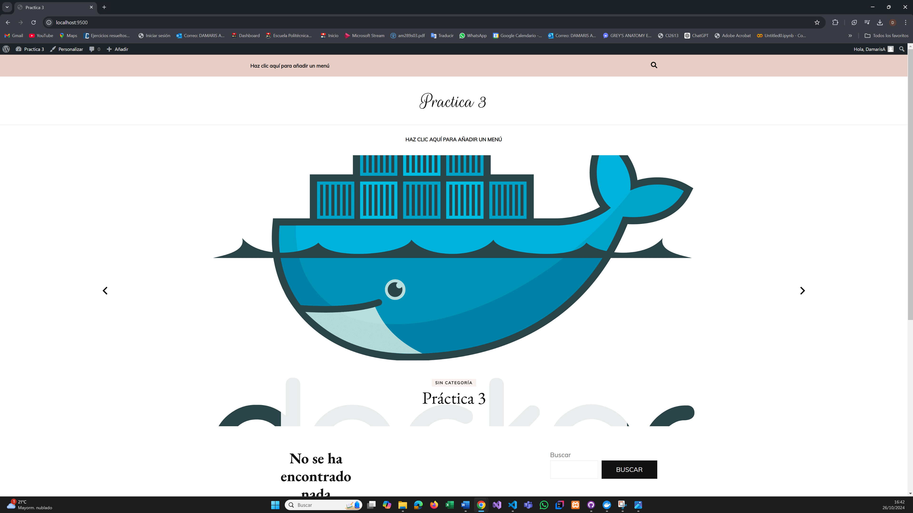

## Esquema para el ejercicio


### Crear red net-wp
```
docker network create net-wp
```

### Para que persista la información es necesario conocer en dónde mysql almacena la información.
# COMPLETAR LA SIGUIENTE ORACIÓN. REVISAR LA DOCUMENTACIÓN DE LA IMAGEN EN https://hub.docker.com/
En el esquema del ejercicio carpeta del contenedor (a) es /var/lib/mysql

Ruta carpeta host: .../ejercicio3/db

### ¿Qué contiene la carpeta db del host?
La carpeta db está vacía.

### Crear un contenedor con la imagen mysql:8  en la red net-wp, configurar las variables de entorno: MYSQL_ROOT_PASSWORD, MYSQL_DATABASE, MYSQL_USER y MYSQL_PASSWORD
```
docker run -d --name mysql-container --network net-wp -e MYSQL_ROOT_PASSWORD=password -e MYSQL_DATABASE=wordpress_db -e MYSQL_USER=user -e MYSQL_PASSWORD=password -v ${PWD}/ejercicio3m/db:/var/lib/mysql mysql:8
```

### ¿Qué observa en la carpeta db que se encontraba inicialmente vacía?
La carpeta db tiene archivos y carpetas para persistir la base de datos fuera del contenedor.

### Para que persista la información es necesario conocer en dónde wordpress almacena la información.
# COMPLETAR LA SIGUIENTE ORACIÓN. REVISAR LA DOCUMENTACIÓN DE LA IMAGEN EN https://hub.docker.com/
En el esquema del ejercicio la carpeta del contenedor (b) es /var/www/html

Ruta carpeta host: .../ejercicio3/www

### Crear un contenedor con la imagen wordpress en la red net-wp, configurar las variables de entorno WORDPRESS_DB_HOST, WORDPRESS_DB_USER, WORDPRESS_DB_PASSWORD y WORDPRESS_DB_NAME (los valores de estas variables corresponden a los del contenedor creado previamente)
```
docker run -d --name wordpress-container --network net-wp -e WORDPRESS_DB_HOST=mysql-container:3306 -e WORDPRESS_DB_USER=user -e WORDPRESS_DB_PASSWORD=password -e WORDPRESS_DB_NAME=wordpress_db -p 9500:80 -v ${PWD}/ejercicio3w/www:/var/www/html wordpress:latest
```

### Personalizar la apariencia de wordpress y agregar una entrada



### Eliminar el contenedor y crearlo nuevamente, ¿qué ha sucedido?
Se han guardado todos los cambios que se han realizado anteriormente a pesar  de que el contenedor se ha eliminado.


